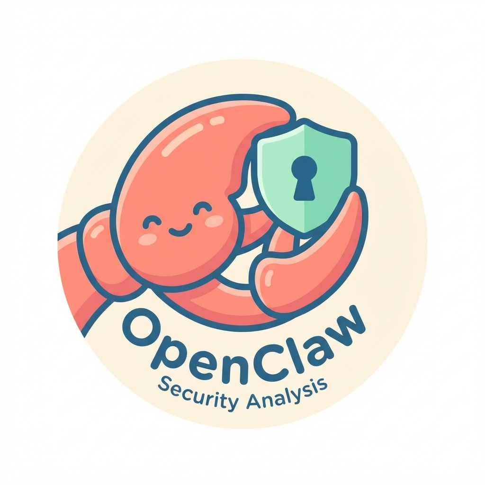

# OpenClaw Security Analysis

<p align="center">
  
</p>

[](https://github.com/xdrshjr/openclaw-security-analysis)
[](https://github.com/xdrshjr/openclaw-security-analysis)
[](https://github.com/xdrshjr/openclaw-security-analysis)

> **Multi-Agent Collaborative Security Assessment of the OpenClaw AI Assistant Framework**

---

## ⚠️ IMPORTANT DISCLAIMER

**This is an EXPERIMENTAL research project designed to validate the effectiveness of multi-agent teams in vulnerability scanning and security audit scenarios.**

### Experimental Nature

- **Purpose**: Explore AI-assisted collaborative security analysis methodologies
- **Approach**: 5 security analysts + 1 QA validator + 1 technical editor working in parallel
- **Limitations**: Findings may contain biases or incomplete assessments typical of experimental environments
- **Usage**: Results are for research and educational purposes only

### Responsible Disclosure

- All vulnerability findings have been documented following responsible disclosure principles
- Proof-of-Concept (PoC) scripts are provided for authorized security research ONLY
- **Do NOT use these scripts for unauthorized access or malicious purposes**
- Independent verification by professional security researchers is recommended before acting on any recommendations

---

## 📖 Project Overview

### What is OpenClaw?

OpenClaw is a powerful open-source personal AI assistant framework featuring:
- **Multi-channel integration**: WhatsApp, Telegram, Slack, Discord, and more
- **Skill extension system**: Plugin-based architecture for custom capabilities
- **Local-first Gateway architecture**: Data stays on your devices
- **Unique layered design**: User Interface → Gateway Control Plane → Channel Adapters → Tool Execution

### Security Assessment Scope

This repository contains a **comprehensive multi-agent security audit** of OpenClaw, analyzing:
- Architecture security (SSRF protection, command execution approval)
- Authentication & authorization mechanisms (ED25519 signatures, device pairing)
- Communication channel security (Webhooks, WebSockets, cross-channel isolation)
- Code execution & sandbox security (Docker containers, command injection)
- Data storage & privacy (encryption, logging, memory management)

---

## 🔍 Key Findings Summary

### Security Dimensions Analyzed

| Dimension | Risk Level | Core Findings | Issues |
|-----------|------------|---------------|---------|
| **Architecture** | 🟡 Medium | SSRF protection is solid but DNS rebinding risks exist; command approval system complexity | 5 |
| **Authentication** | 🟠 Medium-High | Core mechanisms well-designed, but "convenience features" introduce risks | 5 |
| **Communication** | 🟠 Medium-High | Webhook verification gaps, WebSocket replay risks, content marker bypass | 5 |
| **Execution** | 🔴 High | Docker sandbox misconfigurations, command injection bypasses, malicious skill detection evasion | 5 |
| **Data Storage** | 🔴 High | Sensitive data stored in plaintext, incomplete log sanitization, unencrypted memory cache | 5 |

### Overall Security Score: 6/10

| Dimension | Score (1-10) | Assessment |
|-----------|--------------|------------|
| Architecture Design | 7 | Sound layered architecture, some defaults too permissive |
| Authentication | 6.5 | Correct ED25519 usage, dangerous config options exist |
| Communication Security | 6 | Multi-channel complexity, validation needs strengthening |
| Execution Security | 5 | Overly permissive sandbox, static analysis bypassable |
| Data Protection | 5 | Plaintext storage is the biggest weakness |
| **Overall** | **6** | **Good foundation with significant room for improvement** |

---

## 📁 Repository Structure

```
openclaw-security-analysis/
├── tests/                          # 23 PoC test scripts
│   ├── test-01-ssrf-bypass.py
│   ├── test-02-*.py               # Authentication tests (4 files)
│   ├── test-03-*.py               # Communication tests (6 files)
│   ├── test-04-*.py               # Execution tests (5 files)
│   └── test-05-*.py               # Data storage tests (5 files)
│
├── reports/                        # Individual agent reports
│   ├── report-01-architecture-security.md
│   ├── report-02-authentication-security.md
│   ├── report-03-communication-security.md
│   ├── report-04-execution-security.md
│   └── report-05-data-security.md
│
├── images/                         # Architecture diagrams and figures
├── final/                          # Comprehensive final report
│   └── final-comprehensive-security-report.md
│
├── references/                     # Academic and industry references
└── README.md                       # This file
```

---

## 🎯 Critical Security Issues

### 🔴 High Severity

1. **Sensitive Data Stored in Plaintext** (DATA-001)
   - WhatsApp credentials, device tokens stored without encryption
   - File: `device-auth-store.ts` writes JSON without encryption
   - **Impact**: Local privilege escalation, credential theft

2. **Docker Sandbox Configuration Weaknesses** (EXEC-001)
   - Runs as root user by default
   - No resource limits (CPU/memory)
   - Missing capability restrictions (`cap-drop=ALL`)
   - **Impact**: Container escape, host system compromise

3. **Dangerous Configuration Options** (AUTH-002)
   - `dangerouslyDisableDeviceAuth`: Completely bypasses ED25519 signature verification
   - `allowInsecureAuth`: Allows HTTP environments to skip device authentication
   - **Impact**: Complete authentication bypass

4. **Content Marker Bypass via Unicode** (COMM-003)
   - Full-width characters can bypass `<<<EXTERNAL_UNTRUSTED_CONTENT>>>` markers
   - **Impact**: Prompt injection attacks, unauthorized command execution

### 🟠 Medium Severity

5. **Command Injection Bypass** (EXEC-002)
   - Unicode line separators (`\u2028`) can bypass control character filtering
   - NULL byte truncation possible
   - **Impact**: Arbitrary command execution

6. **Webhook Secret Validation Gaps** (COMM-001)
   - Complex configuration inheritance may lead to unexpected verification bypass
   - **Impact**: Unauthorized webhook processing

7. **WebSocket Replay Attacks** (COMM-002)
   - No sequence number validation or timestamp checking
   - **Impact**: Message replay, session hijacking

8. **Malicious Skill Detection Evasion** (EXEC-004)
   - Static analysis can be bypassed via string concatenation, Base64 encoding, delayed execution
   - **Impact**: Execution of malicious plugins

### 🟡 Low Severity

9. **Signature Time Skew Too Permissive** (AUTH-004)
   - 10-minute tolerance window (should be 60-120 seconds)
   - **Impact**: Replay attack window

10. **Incomplete Log Sanitization** (DATA-002)
    - Shared log directory in `/tmp`
    - Sensitive fields may appear in debug logs
    - **Impact**: Information disclosure

---

## 🧪 Proof-of-Concept Tests

This repository includes **23 PoC test scripts** demonstrating various security issues:

### Test Coverage by Agent

| Agent | Focus Area | Test Files | Test Cases |
|-------|-----------|------------|------------|
| Agent-1 | Architecture Security | `test-01-ssrf-bypass.py` | 15+ SSRF bypass attempts |
| Agent-2 | Authentication | `test-02-*.py` (4 files) | 46+ auth bypass scenarios |
| Agent-3 | Communication | `test-03-*.py` (6 files) | 71+ channel security tests |
| Agent-4 | Code Execution | `test-04-*.py` (5 files) | 51+ sandbox escape attempts |
| Agent-5 | Data Storage | `test-05-*.py` (5 files) | 33+ data privacy checks |

### Running the Tests

```bash
# Navigate to tests directory
cd tests

# Run all tests
python3 -m pytest test-*.py -v

# Run specific category
python3 test-01-ssrf-bypass.py
python3 test-05-01-plaintext-storage.py
```

**Note**: These tests are designed for security research and educational purposes. Run them only in isolated environments.

---

## 🛠️ Remediation Roadmap

### 🔴 P0 - Immediate (1-2 weeks)

1. **Encrypt Sensitive Data Storage**
   ```typescript
   // Use system keychain or encrypted storage
   import { encrypt, decrypt } from './crypto';
   function writeStoreEncrypted(filePath: string, store: DeviceAuthStore, masterKey: Buffer): void {
     const encrypted = encrypt(JSON.stringify(store), masterKey);
     fs.writeFileSync(filePath, encrypted, { mode: 0o600 });
   }
   ```

2. **Harden Docker Sandbox**
   ```dockerfile
   # Add non-root user
   RUN useradd -m -u 1000 openclaw
   USER openclaw
   ```
   ```bash
   # Runtime restrictions
   docker run \
     --memory=512m --memory-swap=512m \
     --cpus=0.5 --pids-limit=100 \
     --cap-drop=ALL --security-opt=no-new-privileges \
     --read-only \
     openclaw:sandbox
   ```

3. **Remove or Warn Dangerous Configurations**
   - Remove `dangerouslyDisableDeviceAuth` or restrict to debug mode only
   - Add prominent warnings: "🚨 Device authentication disabled - NOT for production!"

### 🟠 P1 - Short-term (1-3 months)

4. **Enhance Log Sanitization**
   - Implement comprehensive field redaction
   - Move logs out of `/tmp` to user-specific directories

5. **Fix Content Marker Bypass**
   - Use strict Unicode normalization (NFKC)
   - Reject content with marker variants

6. **Reduce Signature Time Skew**
   ```typescript
   const DEVICE_SIGNATURE_SKEW_MS = 60 * 1000; // 60 seconds
   ```

7. **Strengthen Static Analysis**
   - Implement AST-level code analysis
   - Detect dynamic code execution patterns

### 🟡 P2 - Mid-term (3-6 months)

8. **Skill Code Signing**
   ```bash
   openclaw skill install --verify-signature required
   ```

9. **System Keychain Integration**
   - macOS: Keychain
   - Linux: Secret Service API
   - Windows: Credential Manager

10. **Behavioral Monitoring**
    - Filesystem access auditing
    - Network connection monitoring

11. **Seccomp-bpf Implementation**
    - System call filtering
    - Principle of least privilege

---

## 📊 Attack Paths Analyzed

### Path 1: Local Privilege Escalation
```
Plaintext credential storage → Read creds.json → Obtain WhatsApp identity → Impersonate user
```

### Path 2: Supply Chain Compromise
```
Malicious skill published → User installs → postinstall script executes → System compromised
```

### Path 3: WebSocket Hijacking
```
CSWSH attack → Hijack WebSocket connection → Execute arbitrary commands
```

### Path 4: Sandbox Escape
```
Malicious code → Exploit Docker misconfigurations → Container escape → Host control
```

---

## 📚 References

### Academic Papers

1. **Greshake, K., et al. (2023).** "Not What You've Signed Up For: Compromising Real-World LLM-Integrated Applications with Indirect Prompt Injection." *ACM CCS 2023*.

2. **Zimmerman, J., et al. (2019).** "Small World with High Risks: A Study of Security Threats in the npm Ecosystem." *USENIX Security 2019*.

3. **Chen, A., et al. (2021).** "Mitigating DNS Rebinding Attacks on Private Networks." *USENIX Security 2021*.

### Industry Standards

4. **OWASP. (2024).** *Server-Side Request Forgery (SSRF) Prevention Cheat Sheet.* OWASP Foundation.

5. **NIST. (2020).** *SP 800-57 Part 1 Rev. 5: Recommendation for Key Management.*

6. **CWE/SANS. (2023).** *CWE-312: Cleartext Storage of Sensitive Information.* MITRE Corporation.

See `references/` directory for complete bibliography (28 references total).

---

## 🤝 Contributing

This is an experimental research project. We welcome:

- Security researchers reviewing our methodology
- Suggestions for improving multi-agent collaboration
- Additional PoC tests for uncovered attack vectors
- Feedback on risk assessment accuracy

**Please open an issue or submit a pull request.**

---

## 📄 License

This project is provided for **educational and research purposes only**.

- PoC scripts are intended for authorized security testing
- Always obtain proper authorization before testing systems you do not own
- The authors assume no liability for misuse of the provided materials

---

## 🙏 Acknowledgments

### Multi-Agent Team

This security assessment was conducted by a collaborative team of AI agents:

| Role | Agent ID | Responsibility |
|------|----------|----------------|
| Security Analyst | Agent-1 | Architecture security (SSRF, command execution) |
| Security Analyst | Agent-2 | Authentication & authorization |
| Security Analyst | Agent-3 | Communication channel security |
| Security Analyst | Agent-4 | Code execution & sandbox security |
| Security Analyst | Agent-5 | Data storage & privacy |
| QA Validator | Agent-QA | Cross-validation and verification |
| Technical Editor | Agent-Final | Report integration and quality assurance |

**Analysis Date**: February 6, 2026  
**Report Version**: 1.0  
**Total Word Count**: ~9,500 words

---

## 📞 Contact

**GitHub Repository**: [https://github.com/xdrshjr/openclaw-security-analysis](https://github.com/xdrshjr/openclaw-security-analysis)

For questions about the multi-agent methodology or findings, please open an issue in this repository.

---

<div align="center">

**⚠️ Remember: Security is like riding a bicycle - if you're not moving forward, you fall down.**

OpenClaw's motto is "EXFOLIATE! EXFOLIATE!" (Shed! Renew!) - may this project continuously evolve stronger security shells 🦞

</div>
